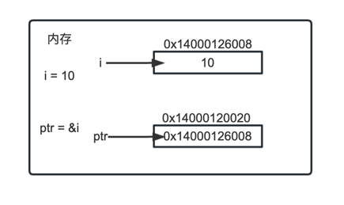

### 指针类型

- 操作内存地址，在不改变内存地址的情况下更改内容



```golang
package main
import (
	"fmt"
)

//演示golang中指针类型
func main() {

	//基本数据类型在内存布局
	var i int = 10
	// i 的地址是什么,&i
	fmt.Println("i的地址=", &i)
	
	//下面的 var ptr *int = &i
	//1. ptr 是一个指针变量
	//2. ptr 的类型 *int
	//3. ptr 本身的值&i
	var ptr *int = &i 
	fmt.Printf("ptr=%v\n", ptr)
	fmt.Printf("ptr 的地址=%v", &ptr) 
	fmt.Printf("ptr 指向的值=%v", *ptr)
	// 定义一个 int 变量 num 并打印到终端，并将其地址赋值给指针 ptr ，并通过 ptr 去修改 num 的值
	var num int = 9
	fmt.Printf("num address=%v\n", &num)

	var ptr *int 
	ptr = &num
	*ptr = 10 //这里修改时，会到num的值变化
	fmt.Println("num =" , num)
	var a_b int = 20
	fmt.Println(a_b)

	var int int = 30
	fmt.Println(int)
}
```
### 类型分类

- 值类型：变量直接存储值，内存通常在栈中分配
  - 基本数据类型 int 、float 、bool、string、数组、结构体(struct)
- 引用类型：变量存储的是一个地址，这个地址对应的空间才是真正存储的数据(值)，内存通常在堆上分配，当没有任何变量引用这个地址时，该地址对应的数据空间就成为一个垃圾，由GC来回收。
  - 指针、切片(slice)、map、管道(chan)、interface

### 标识符的命名规范

##### 标识符概念

- 1）Golang 对各种变量、方法等命名时使用的字符序列称为标识符
- 2）凡是自己可以起名字的地方都叫标识符
- 
##### 标识符的命名规则

- 1）由26个英文字母大小写，0-9，_组成
- 2）数字不可以开头。
- 3）Golang中严格区分大小写。
- 4）标识符不能包含空格。
- 5）下划线"_"本身在Go中是一个特殊的标识符，称为空标识符。可以代表任何其它的标识符，但是它对应的值会被忽略(比如：忽略某个返回值)。所以仅能被作为占位符使用，不能作为标识符使用。
- 6）不能以系统保留关键字作为标识符，关键字如下：
  - break case chan const continue 
  - default defer else fallthrough for 
  - func go goto if import 
  - interface map package range return 
  - select struct switch type var

```golang
package main
import "fmt"

//演示golang中标识符的使用
func main() {

	//Golang中严格区分大小写
	//golang 中 认为 num 和 Num是不同的变量
	var num int = 10
	var Num int = 20
	fmt.Printf("num=%v Num=%v\n", num, Num)

	//标识符不能包含空格
	//var ab c int = 30

	//_ 是空标志符，用于占用
	// var _ int = 40 //error
	// fmt.Println(_)

	var int int = 90
	fmt.Println(int)
}
```


##### 标识符命名注意事项

- 1）包名：保持package的名宇和目录保持一致，尽量采取有意义的包名，简短，有意义，不要和标准库不要冲突
- 2）变量名、函数名、常量名：采用驼峰法。
- 3）如果变量名、函数名、常量名 首字母大写，则可以被其他的包访问；如果首字母小写，则只能在本包中使用（注：可以简单的理解成，首字母大写是公有的，首字母小写是私有的）

##### 预定义标识符

- 除了保留关键字外，Go还提供了36个预定的标识符，其包括基础数据类型和系统内嵌函数
  - append complex64 float64 int32 nil recover bool complex128 
  - imag int64 panic string byte uint16 int iota uint64 true 
  - cap copy int8 len print uint close false int16 make 
  - println uint8 complex float32 uint32 new real uintprt