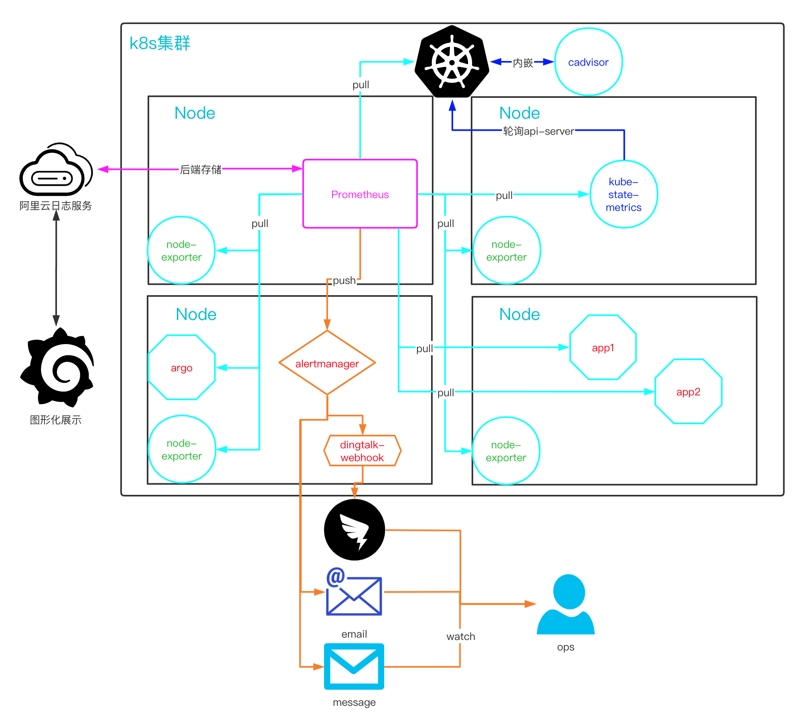

# Exporter

目录
=================

* [Exporter](#exporter)
   * [集群概览](#集群概览)
   * [一、基础资源](#一基础资源)
      * [Node-exporter](#node-exporter)
   * [二、集群资源](#二集群资源)
      * [kube-state-metrics](#kube-state-metrics)

## 集群概览

## 一、基础资源

### Node-exporter

~~~bash
apiVersion: apps/v1
kind: DaemonSet
metadata:
  name: node-exporter
  labels:
    name: node-exporter
spec:
  selector:
    matchLabels:
     name: node-exporter
  template:
    metadata:
      labels:
        name: node-exporter
    spec:
      hostPID: true
      hostIPC: true
      hostNetwork: true
      containers:
      - name: node-exporter
        image: prom/node-exporter:latest
        ports:
        - containerPort: 9100
        resources:
          requests:
            cpu: 0.15
        securityContext:
          privileged: true
        args:
        - --path.procfs
        - /host/proc
        - --path.sysfs
        - /host/sys
        - --collector.filesystem.ignored-mount-points
        - '"^/(sys|proc|dev|host|etc)($|/)"'
        volumeMounts:
        - name: dev
          mountPath: /host/dev
        - name: proc
          mountPath: /host/proc
        - name: sys
          mountPath: /host/sys
        - name: rootfs
          mountPath: /rootfs
      tolerations:
      - key: "node-role.kubernetes.io/master"
        operator: "Exists"
        effect: "NoSchedule"
      volumes:
        - name: proc
          hostPath:
            path: /proc
        - name: dev
          hostPath:
            path: /dev
        - name: sys
          hostPath:
            path: /sys
        - name: rootfs
          hostPath:
            path: /
~~~

## 二、集群资源

### kube-state-metrics
~~~bash
apiVersion: apps/v1
kind: Deployment
metadata:
  name: kube-state-metrics
spec:
  replicas: 1
  selector:
    matchLabels:
      app: kube-state-metrics
  template:
    metadata:
      annotations:
        ack.aliyun.com: c35166695291649498d2d18153b3cbba0
        prometheus.io/path: /metrics
        prometheus.io/port: "8080"
        prometheus.io/scheme: http
        prometheus.io/scrape: "true"
      labels:
        app: kube-state-metrics
    spec:
      serviceAccountName: kube-state-metrics
      containers:
      - name: kube-state-metrics
        image: quay.io/coreos/kube-state-metrics:latest
        ports:
        - containerPort: 8080

---
apiVersion: v1
kind: ServiceAccount
metadata:
  name: kube-state-metrics

---
apiVersion: rbac.authorization.k8s.io/v1
kind: ClusterRole
metadata:
  name: kube-state-metrics
rules:
- apiGroups: [""]
  resources: ["nodes", "pods", "services", "resourcequotas", "replicationcontrollers", "limitranges", "persistentvolumeclaims", "persistentvolumes", "namespaces", "endpoints"]
  verbs: ["list", "watch"]
- apiGroups: ["apps"]
  resources: ["daemonsets", "deployments", "replicasets","statefulsets"]
  verbs: ["list", "watch"]
- apiGroups: ["batch"]
  resources: ["cronjobs", "jobs"]
  verbs: ["list", "watch"]
- apiGroups: ["autoscaling"]
  resources: ["horizontalpodautoscalers"]
  verbs: ["list", "watch"]
- apiGroups: ["storage.k8s.io"]
  resources: ["storageclasses"]
  verbs: ["list", "watch"]

---
apiVersion: rbac.authorization.k8s.io/v1
kind: ClusterRoleBinding
metadata:
  name: kube-state-metrics
roleRef:
  apiGroup: rbac.authorization.k8s.io
  kind: ClusterRole
  name: kube-state-metrics
subjects:
- kind: ServiceAccount
  name: kube-state-metrics

---
apiVersion: v1
kind: Service
metadata:
  annotations:
    prometheus.io/scrape: 'true'
  name: kube-state-metrics
  labels:
    app: kube-state-metrics
spec:
  ports:
  - name: kube-state-metrics
    port: 8080
    protocol: TCP
  selector:
    app: kube-state-metrics

~~~
